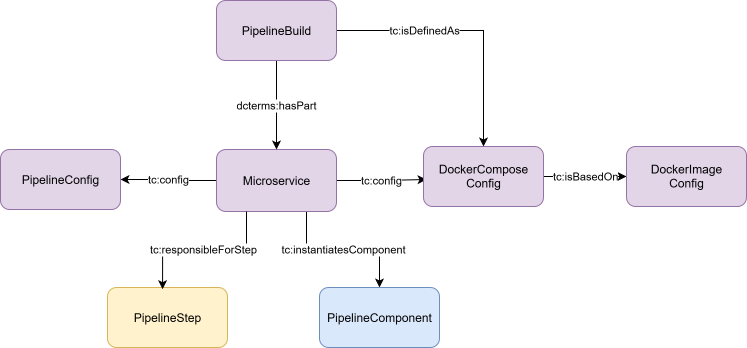

# Table Of Contents

- [1. Overview](#1-overview)
    - [1.1. Introduction](#11-introduction)
    - [1.2 Term definitions](#12-term-definitions)

- [2. Ontology](#2-ontology)
    - [2.1. Namespaces](#21-namespaces)
    - [2.2. Relation to other ontologies](#22-relation-to-other-ontologies)
    - [2.3. Core Classes](#23-core-classes)
    - [2.4. Additional Classes](#24-additional-classes)
    - [2.5. Subclasses of Config](#25-subclasses-of-config)
    - [2.6. Future Directions](#26-future-directions)
- [3. Examples](#3-examples)
    - [3.1. Ldio example](#31-ldio-example)
    - [3.2. RDF Connect example](#32-rdf-connect-example)

  

# 1. Overview
## 1.1 Introduction
*Intention*: discoverability, replication, modular design, separation of concerns, ease of use 
  
The goal is to design a framework-agnostic, streaming-oriented pipeline orchestration system for Linked Data. Pipelines are described semantically using RDF, and execution is realized across multiple frameworks (currently LDIO, RDF Connect, semantic.works) using Docker containers and RDF Connect for orchestration. For this purpose, the *toolchain* ontology is developed.

The *toolchain* ontology allows to describe data pipelines for the purpose of replicability. Four Core Classes are established, each of which are concerned with different responsibilities. Providing a minimal **Pipeline Definition** is sufficient to allow replication of a pipeline. Pipelines are defined as a series of data transformation steps, which are executed by Pipeline Components. These Pipeline Components are collected in a **Component Catalog**, which hence provides the resources for building a pipeline. A Pipeline Generator takes a Pipeline Definition and attempts to build an executable pipeline based on the resources at its disposal in the Component Catalog. The **Pipeline Build** is the output of the Pipeline Generator and reflects a deployable pipeline.
  
Splitting the *toolchain* ontology into these four Core Classes leaves a clean separation of concerns: The Pipeline Definition allows the user to create new pipelines with minimal effort: It is sufficient to describe which Pipeline Components provide data to other Pipeline Components, and to provide Configs to configure each one used in the Pipeline. The Component Catalog is based on the idea that each Pipeline Component is modular and should be easy to reuse. Hence, all information that is known about a Pipeline Component (and which may be relevant for a Pipeline Generator) should be included in the Component Catalog. This allows a user to merely point to the Pipeline Component in the Component Catalog when defining a particular Pipeline Step. Hence, essential details about the component do not need to be repeated with each new Pipeline Definition. Likewise, distinguishing between the Pipeline Definition and the Pipeline Build allows defining Pipelines without having to be concerned with their implementation. It is up to the Pipeline Generator to figure out a feasible implementation of the pipeline, allowing to largely automate this process: Based on what is known about each Pipeline Component, the feasibility of the defined Pipeline can be evaluated and a corresponding Pipeline Build can be generated.  
 
Even if the Pipeline Generator is not utilized, the *toolchain* ontology provides a unified language for describing pipelines across different frameworks. This has several advantages. Pipelines and Pipeline Components become discoverable, allowing a community to grow around the idea of sharing modular resources for building pipelines. Datasets can be described by the pipelines that generated them, allowing full provenance. Pipeline Definitions can be subjected to automated validation, so that the feasibility of pipelines does not have to be evaluated through trial and error. 
  

## 1.2 Term definitions

| Term | Definition |
| ----- | ----- |
| **Pipeline** | We understand a Pipeline as an arrangement of modular data transformation steps, whereby each step acts on data in a well-defined, configurable way, before forwarding the data to the next step. These steps can be arranged in a nonlinear way, similar to a directed acyclic graph: Steps can receive zero or more inputs and outputs. To qualify as Pipeline, all Steps have to be directly or indirectly chained to each other. |
| **Data** | Data is any kind of digital content that carries information of interest. This information can be extracted through transformation and made available through transportation, i.e. through Pipelines. As such, Data are the entities that are send through pipeslines to make information available at a target location. |
| **Config** | A Config defines the expected (transformation) behavior for each Step in a Pipeline. As such, it differs from Data in so far as it is not subject to transformation itself, does not provide much valuable information beyond the behavior within the Pipeline, and is also not send through the Pipeline. | 
| **Instance** | We understand instantiating Pipeline Components as installing or deploying these so that they are ready to run. | 
  

# 2. Ontology
## 2.1. Namespaces
| prefix |	namespace IRI | documentation |
|----------|----------|----------|
| tc  | toolchain  | the document you are currently reading |
| rdf  | http://www.w3.org/1999/02/22-rdf-syntax-ns#  | https://www.w3.org/TR/rdf11-concepts/ |
| rdfs | http://www.w3.org/2000/01/rdf-schema#  | https://www.w3.org/TR/rdf-schema/ |
| rdfc | https://w3id.org/rdf-connect# | https://rdf-connect.github.io/specification/ |
| p-plan  | http://purl.org/net/p-plan# | https://vocab.linkeddata.es/p-plan/index.html |
| prov  | http://www.w3.org/ns/prov# | https://www.w3.org/TR/prov-o/ |
| sh  | http://www.w3.org/ns/shacl#  | https://www.w3.org/TR/shacl/ |
| dcat  | http://www.w3.org/ns/dcat#  | https://www.w3.org/TR/vocab-dcat-3/ |
| dcterms | http://purl.org/dc/terms/ | https://www.dublincore.org/specifications/dublin-core/dcmi-terms/ |
  

## 2.2. Relation to other ontologies
- The [p-plan ontology](https://vocab.linkeddata.es/p-plan/index.html) is used for the *Pipeline Definition*. This is because the *Pipeline Definition* reflects a plan of a pipeline to be built and executed.
- The [dcat-ontology](https://www.w3.org/TR/vocab-dcat-3/) is used for the *Component Catalog* , which allows expressing Pipeline Components as resources in a catalog. 
- The [prov-ontology](https://www.w3.org/TR/prov-o/) is used for the *Pipeline Build*. This allows to express the link between dcat:datasets and the pipelines that generated them. 
  

## 2.3. Core Classes
 

### Component Catalog

| | |
|----------|----------|
| **Definition** | A Component Catalog is a collection of the Pipeline Components. Each Pipeline Component is a modular unit that can be instanced within a pipeline build. Th Component Catalog stores information for each Pipeline Component, which is relevant for instancing. Such information are for example dependencies or constraints that come with including a pipeline component in a pipeline.
| **subclass of** | dcat:Catalog |
 

### Pipeline Definition

| | |
|----------|----------|
| **Definition** | A Pipeline Definition describes the intented pipeline to be run. It is hence a plan for a pipeline that needs to be build. It is sufficient to define which Pipeline Component is responsible for which Pipeline Step (via Assignment) and to give this Pipeline Component a Config to define its behavior. |
| **subclass of** | p-plan:Plan |
 

### Pipeline Generator

| | |
|----------|----------|
| **Definition** | A Pipeline Generator compiles a system capable of executing a Pipeline Definition by looking up the Pipeline Components implicated in the pipeline. Based on a Pipeline Definition and the Component Catalog, it produces a Pipeline Build. Therefore it is up to the Generator to decide how the information in the Pipeline Definition and Component Catalog can be interpreted to produce a deployable pipeline. |
| **subclass of** | prov:SoftwareAgent |

### Pipeline Build

| | |
|----------|----------|
| **Definition** | A Pipeline Build reflects the pipeline that was generated by the Pipeline Generator, and which is ready for deployment. A Pipeline Run of a deployed pipeline may have generated or consumed a dataset. By hence linking a pipeline run to a pipeline build, it is possible to provide full provenance for datasets. |
| **subclass of** | prov:SoftwareAgent |
 

## 2.4. Additional Classes
 

### PipelineStep
| | |
|----------|----------|
| **Definition** | A PipelineStep is any step in a pipeline which acts on data. This can mean producing, transforming, consuming data (ETL) or a combination of these. As part of the Pipeline Definition, a Pipeline Step declares intent, it is up to the Pipeline Generator to generate a Pipeline Build capable of executing the Pipeline Step. |
| **subclass of** | p-plan:Step |
 

### PipelineComponent
| | |
|----------|----------|
| **Definition** | A Pipeline Component is any modular unit that can be included in a pipeline to help execute a PipelineStep. It may be a component which produces or transforms data. It may also be a component which is not responsible for forwarding data, but which is needed because another Pipeline Components depends on it. Pipeline Components are resources of the Component Catalog. Therefore, the need to be described with information relevant for their deployment, such as dependencies and constraints. |
| **subclass of** | osw:Software |
 

### Config
| | |
|----------|----------|
| **Definition** | A Config is a set of input parameters for a Pipeline Component, which defines its behavior in a pipeline. In its simplest case, it is a set of key-value pairs. However, also nested configurations are possible. As a data structure a Config is equivalent to the "object" type in JSON, consisting of an unordered set of name/value pairs. The name is a string and the value is a string, number, boolean, array, or object (same concept as in the [Common Workflow Language](https://www.commonwl.org/v1.2/Workflow.html#Data_concepts)), resulting in an unordered, tree-like (acyclic) structure. Each Config requires either a tc:embedded or tc:literal-predicate. This tells the Pipeline Generator whether the Config is contained in the graph or must be parsed from a string-literal. If tc:embedded is used, the Config points to a blank node representing a data object: Predicates serve as keys and objects as values. If tc:literal is used, the Config points to a string of either json- or yaml-format. In this case the Pipeline Generator parses the string to extract the configuration data. A Config can be stored as a preset in the Component Catalog. In this case a Pipeline Component can point to its associated Configs via tc:storedConfig. This is ideal for attaching default configurations, or attaching configurations often needed for specific use cases. As part of an Assignment and hence Pipeline Definition (see below), tc:assignedConfig can either point to one of these pre-made Configs or to a newly defined Config. |
| **subclass of** | - |
 

### Assignment 
| | |
|----------|----------|
| **Definition** | As part of the Pipeline Definition, an assignment defines which Pipeline Component is responsible for executing a Pipeline Step, and how that component should be configured. If more than one Pipeline Component is responsible for executing a PipelineStep (such as using a processor with a specific runner of the RDF Connect framework, for example), each of these Pipeline Components can receive its own assigned Config by attaching several Assignments to a Pipeline Step. 
 |
| **subclass of** | p-plan:Variable |
 

### sh:NodeShape
| | |
|----------|----------|
| **Definition** | A NodeShape reflects a constraint, which needs to be validated whenever a Pipeline Component becomes part of a Pipeline Build. These constraints can concern different aspects of a Pipeline Build. For example, each Config assigned to a specific Pipeline Component may have to comply to a schema. A Pipeline Component may not accept data input from another Component, because it itself produces data. Or a Pipeline Component may pose specific constraints on how Pipeline Steps may be linked, such as expecting a strictly linear pipeline. It is also possible to describe constraints for the expected data input and output of Pipeline Components.Taken together, defining NodeShapes are a powerful tool to ensure that pipelines run as expected before being deployed. These constraints are expressed as SHACL-shapes to allow automatic validation. Each sh:NodeShape should have a sh:message for human readibility. These should clearly indicate and describe what kind of constraint is imposed, to allow easier implementation of the logic behind the constraint. Node Shapes are only indirectly linked to Pipeline Components via dcat:Relationship. This allows to further qualify the relationship between Pipeline Components and their constraints. For example, dcat:Role can be used to indicate that a constraint belongs to a specific category, for example concerning input data, output data or Configs. Dcat:Relationship may also be used to define when a constraint should be validated, for example before or after building the pipeline. 
| **subclass of** | - |
 

### Microservice
| | |
|----------|----------|
| **Definition** | A Microservice is the core entity of a Pipeline Build. Each Pipeline Build consists of one or more Microservices, which are responsible for executing one or more Pipeline Steps. For this purpose, one or more Pipeline Components are instantiated within the Microservice. A Microservice is defined through several Configs, which are generated by the Pipeline Generator as part of the Pipeline Build. These Configs define how the Microservice should be build, started up, and configured for its task. 
| **subclass of** | --- |
 

## 2.5. Subclasses of Config

### DockerImageConfig
| | |
|----------|----------|
| **Definition** | The DockerImageConfig defines how the Docker Image must be build to include the necessary dependencies for the Microservice. |
| **subclass of** | tc:Config |

### DockerComposeConfig
| | |
|----------|----------|
| **Definition** | The DockerComposeConfig defines how the Microservice should be started up, for example which volumes should be mounted and which ports should be opened. |
| **subclass of** | tc:Config |
 

### PipelineConfig
| | |
|----------|----------|
| **Definition** | The PipelineConfig are those input parameters that the Microservice requires to execute the Pipeline Steps as intended.  |
| **subclass of** | tc:Config |
 

### DefaultConfig
| | |
|----------|----------|
| **Definition** | The Config that should be used for a PipelineComponent if not other Config is assigned in a PipelineDefinition.  |
| **subclass of** | tc:Config |
 

## 2.6. Future Directions 
- We may want to be able to express that a PipelineComponent requires one of several Pipeline Components, i.e. the concrete Assignment is optional.
 

# 3. Examples

## 3.1. LDIO example:
~~~
:LdioExamplePipeline a tc:PipelineDefinition;
    rdfs:label "LDIO Example Pipeline";
    rdfs:comment "A simple example pipeline using components of the LDIO framework.".

:LDESClientStep a tc:PipelineStep;
        p-plan:isStepOfPlan :LdioExamplePipeline;
        p-plan:hasInputVar [ 
            a tc:Assignment;
            tc:assignedComponent ldio:LdesClient;
            tc:assignedConfig :LdesClientConfig
        ] .
        
:ConsoleOutStep a tc:PipelineStep;
        p-plan:isStepOfPlan :LdioExamplePipeline;
        p-plan:hasInputVar [ 
            tc:assignedComponent ldio:ConsoleOut;
            tc:assignedConfig :ConsoleOutConfig
        ] .
        
:ConsoleOutStep p-plan:isPrecededBy :LDESClientStep .

:LdesClientConfig a tc:Config;
    tc:embedded [
        :urls "https://ca-westtoerwin-nginx-prod.livelyisland-1fa58ea1.westeurope.azurecontainerapps.io/touristattractions/latestView";
        :retries [ :enabled true] ;
    ] .

:ConsoleOutConfig a tc:Config;
    tc:embedded [
        :rdf-writer 
            [:content-type "text/turtle"] ;
    ] .
~~~

Based on this pipeline, the pipeline generator looks up the referenced pipeline components in the component catalog:
~~~
:DishacledComponentCatalog a tc:ComponentCatalog, dcat:Catalog;
    dcat:resource  
            ldio:LdesClient, 
            ldio:SparqlConstructTransformer,
            ldio:ConsoleOut,
            ldio:LinkedDataInteractionsOrchestrator,
            rdfc:LdesClient,
            rdfc:NodeRunner,
            rdfc:Orchestrator
            ... 

ldio:ConsoleOut a tc:PipelineComponent ;
    rdfs:label "Ldio:ConsoleOut" ; 
    dcterms:requires ldio:LinkedDataInteractionsOrchestrator ;
    ldio:type "Output" ; # Specific property of Ldio
    dcat:qualifiedRelation [
        dcterms:relation :LdioConsoleOutConfigShape ;
        dcat:hadRole :configShape ; # This tells the PipelineGenerator that any Config assigned to ldio:ConsoleOut has to be validated by this shape, whenever ldio:ConsoleOut is included in a Pipeline Build. 
    ] .

:LdioConsoleOutConfigShape
        a sh:NodeShape ;
        sh:targetClass tc:PipelineConfig ; # Constraints the target further to a specific subclass of tc:Config.  
        sh:property [
            sh:path tc:embedded ;
            sh:node [
                a sh:NodeShape ;
                sh:property [
                sh:path ( :rdf-writer :content-type ) ;
                    sh:datatype xsd:string ;
                    sh:minCount 0 ;
                    sh:maxCount 1 ;
                    sh:message "content-type may have max one value of type string." ;
                ] ;
            ] ;
        ] . 

ldio:LinkedDataInteractionsOrchestrator
    a tc:PipelineComponent ;
    rdfs:label "Linked Data Interactions Orchestrator" ;
    osw:hasProjectWebsite "https://informatievlaanderen.github.io/VSDS-Linked-Data-Interactions/2.8.0-SNAPSHOT/" ;
    osw:hasSoftwareVersion [
          osw:hasVersionId "2.8.0-SNAPSHOT"
          ] ;
    
    tc:storedConfig [
        a tc:DefaultConfig, tc:DockerComposeConfig ;
        tc:literal """
  ldio-workbench:
    container_name: ldio-workbench
    image: ldes/ldi-orchestrator:2.8.0-SNAPSHOT
    ports:
      - "8080:8080"
"""
    ] ;
    dcterms:requires ldio:LdioPipelineStarterService ;
    dcat:qualifiedRelation [
        dcterms:relation :LdioProcessorTypeConstraintShape, # Specific constraints checking the validity of Ldio pipeline segments
                         :LdioSingleFlowChainShape , 
                         :LdioTypeOrderShape ;
    ] .

ldio:LdioPipelineStarterService  # Service that will start the Ldio pipeline segment once the ldio workbench is up
    a tc:PipelineComponent ;
    rdfs:label "Ldio Pipeline Starter Service" ;
    tc:storedConfig [
        a tc:DefaultConfig, tc:DockerComposeConfig ;
        tc:literal '''
ldio-pipeline-starter:
    image: curlimages/curl
    volumes:
      - ./ldio_pipeline.yml:/pipeline.yml:ro
    command: >
      sh -c "
      sleep 30 &&
      curl -X POST
      -H 'content-type: application/yaml'
      http://ldio-workbench:8080/admin/api/v1/pipeline
      --data-binary @/pipeline.yml
      "         
''' ;
] .
   	
~~~

## 3.2. RDF Connect example:
~~~
:RdfcExamplePipeline a tc:PipelineDefinition;
    rdfs:label "RDF Connect Example Pipeline";
    rdfs:comment "An example of a RDF Connect pipeline which uses Javascript and Python components".

:step_1 a tc:PipelineStep;
        p-plan:isStepOfPlan :RdfcExamplePipeline;
        p-plan:hasInputVar [ 
            tc:assignedComponent rdfc:LdesClient;
            tc:assignedConfig :step_1_config
        ] .

:step_2 a tc:PipelineStep;
        p-plan:isStepOfPlan :RdfcExamplePipeline;
        p-plan:hasInputVar [ 
            tc:assignedComponent rdfc:Buffer;
            tc:assignedConfig :step_2_config
        ] .

:step_3 a tc:PipelineStep;
        p-plan:isStepOfPlan :RdfcExamplePipeline;
        p-plan:hasInputVar [ 
            tc:assignedComponent rdfc:LogProcessorPy;
            tc:assignedConfig :step_3_config
        ] .

:step_3 p-plan:isPrecededBy :step_2 .
:step_2 p-plan:isPrecededBy :step_1 .

:step_1_config a tc:Config;
    tc:embedded [
        rdfc:url <https://ca-westtoerwin-nginx-prod.livelyisland-1fa58ea1.westeurope.azurecontainerapps.io/touristattractions/latestView>;
        rdfc:follow true
    ] .

:step_2_config a tc:Config;
    tc:embedded [
        rdfc:interval 5000; 
        rdfc:amount 0  
    ] .

:step_3_config a tc:Config;
    tc:embedded [
        rdfc:level "debug";
        rdfc:label "test"
    ] .
~~~

Based on this pipeline, the pipeline generator looks up the referenced pipeline components in the component catalog:

~~~
rdfc:LdesClient
    a tc:PipelineComponent, rdfc:Processor;
    rdfs:label "ldes client";
    rdfs:comment "An LDES client that can read a stream of members from an LDES."; 
    dcterms:requires rdfc:NodeRunner ;
    dcat:qualifiedRelation [
        dcterms:relation :RdfcLdesClientConfigShape,
                         :RdfcLdesClientFetchConfigShape, 
                         :RdfcLdesClientFetchRetryConfigShape,
                         :RdfcLdesClientAuthConfigShape;
        dcat:hadRole :configShape ; 
    ] ;
    owl:imports <./node_modules/ldes-client/processor.ttl> . # This is specifically required for RDF Connect processors

rdfc:Buffer a tc:PipelineComponent, rdfc:Processor;
    rdfs:label "Buffer Processor" ;
    rdfs:comment " At a certain interval, the processor will pipe through a given amount of data from the incoming stream to the outgoing stream.";
    dcterms:requires rdfc:NodeRunner ;
    dcat:qualifiedRelation [
        dcterms:relation :RdfcBufferConfigShape ;
        dcat:hadRole :configShape ; 
    ] ;
    owl:imports <./node_modules/@rdfc/buffer-processor-ts/processor.ttl>. 

rdfc:LogProcessorPy a tc:PipelineComponent, rdfc:Processor;
    rdfs:label "Python Log Processor";
    dcterms:requires rdfc:PyRunner ;
    dcat:qualifiedRelation [
        dcterms:relation :RdfcLogProcessorPyConfigShape ;
        dcat:hadRole :configShape ; 
    ] ;
    owl:imports <../../../usr/local/lib/python3.13/site-packages/rdfc_log_processor/processor.ttl>. # Relative path inside docker container

rdfc:NodeRunner a tc:PipelineComponent, rdfc:Runner;
    rdfs:label "RDF Connect Javascript Node Runner" ; 
    dcterms:requires rdfc:Orchestrator ;
    dcat:qualifiedRelation [
        dcterms:relation :NodeRunnerConfig ;
        dcat:hadRole :configShape ; 
    ] ;
    owl:imports <./node_modules/@rdfc/js-runner/index.ttl> . # This is specific to RDF Connect

rdfc:PyRunner a tc:PipelineComponent, rdfc:Runner;
    rdfs:label "RDF Connect Python Runner" ; 
    dcterms:requires rdfc:Orchestrator ;
    owl:imports <../../../usr/local/lib/python3.13/site-packages/rdfc_runner/index.ttl>.

rdfc:Orchestrator a tc:PipelineComponent ;
    rdfs:label "RDF Connect Orchestrator" ;
    tc:storedConfig [
        a tc:Config, tc:DefaultConfig, tc:DockerComposeConfig ;
        tc:literal """
  rdf-connect:
    container_name: rdf-connect
    image: rdf-connect:latest
    build: ../../resources/rdfc-docker
    volumes:
      - ./rdfc_pipeline.ttl:/workspace/pipeline/pipeline.ttl:ro
    environment:
      LOG_LEVEL: debug
    command: npx rdfc /workspace/pipeline/pipeline.ttl
"""
] .
~~~

Based on a Pipeline Definition, the Pipeline Generator looks up all implicated dependencies via dcterms:requires. It finds the PipelineComponent that has a DockerComposeConfig, as well as a DefaultConfig. This is because it is assumed that dcterms:requires always points to the PipelineComponent, which resolves the dependencies of the component pointing to it (either directly or indirectly). In this example it is hence assumed that the stored DockerComposeConfig of the rdfc:Orchestrator can resolve all dependencies of all PipelineComponents implicated by the Pipeline Definition, as well as its own dependencies. 
  
You can also see in this example that rdfc:Processors are attached to a default rdfc:Runner via dcterms:requires. In some cases, you may want to attach a PipelineComponent to a different PipelineComponent and hence override this default. This is possible via tc:Assignment. See this example:

~~~
:step_1 a tc:PipelineStep;
        p-plan:isStepOfPlan :RdfcExamplePipeline;
        p-plan:hasInputVar [ 
            tc:assignedComponent rdfc:LdesClient;
            tc:assignedConfig :step_1_config;
            dcterms:requires rdfc:JsRunner
        ] .
~~~

Here, Step 1 is configured to use the rdfc:LdesClient in combination with rdfc:JsRunner. In this case, dcterms:requires is overwritten for this specific Pipeline Step. It is also possible to give rdfc:Orchestrator a different Config than the DefaultConfig. You can do it like so:

~~~
:step_1 a tc:PipelineStep;
        p-plan:isStepOfPlan :RdfcExamplePipeline;
        p-plan:hasInputVar [ 
            tc:assignedComponent rdfc:LdesClient;
            tc:assignedConfig :step_1_config;
            dcterms:requires rdfc:JsRunner ;
        ] ,
         [ 
            tc:assignedComponent rdfc:Orchestrator;
            tc:assignedConfig :customOrchestratorConfig;
        ] . 
~~~

In this case, only step_1 will be executed with the custom Orchestrator. If you want the whole pipeline to run with the custom Orchestrator, you can give each PipelineStep the same Assignment (give the Assignment a proper uri and link each step to it). While this is more verbose, this is only needed if you want to overwrite the default settings. The Pipeline Generator and semantic model are designed to take most work away from the user, so in most cases the default settings should work just fine. It is of course also possible to modify the component catalog itself and assign a different Config as DefaultConfig, in which case all steps will automatically refer to this new Config. 

Another possibility is to define the pipeline on the level of the rdfc:Orchestrator from the get-go:
~~~
:step_1 a tc:PipelineStep;
        p-plan:isStepOfPlan :RdfcExamplePipeline;
        p-plan:hasInputVar [ 
            tc:assignedComponent rdfc:Orchestrator;
            tc:assignedConfig :pipelineConfig;
        ] .

:pipelineConfig a tc:PipelineConfig ;
    tc:embedded [
        a rdfc:Pipeline ;
        owl:imports <file:///usr/local/lib/python3.13/site-packages/rdfc_log_processor/processor.ttl>,
            <file:///usr/local/lib/python3.13/site-packages/rdfc_runner/index.ttl>,
            <node_modules/@rdfc/buffer-processor-ts/processor.ttl>,
            <node_modules/@rdfc/js-runner/index.ttl>,
            <node_modules/ldes-client/processor.ttl> ;
        rdfc:consistsOf :env_1,
            :env_2 .
    ] .

:env_1 rdfc:instantiates rdfc:JsRunner ;
    rdfc:processor :step_1, :step_2 .

:env_2 rdfc:instantiates rdfc:PyRunner ;
    rdfc:processor :step_3 .

:step_1 a rdfc:LdesClient ;
    rdfc:follow true ;
    rdfc:output :channel_1 ;
    rdfc:url <https://ca-westtoerwin-nginx-prod.livelyisland-1fa58ea1.westeurope.azurecontainerapps.io/touristattractions/latestView> .

:step_2 a rdfc:Buffer ;
    rdfc:amount 0 ;
    rdfc:incoming :channel_1 ;
    rdfc:interval 5000 ;
    rdfc:outgoing :channel_2 .

:step_3 a rdfc:LogProcessorPy ;
    rdfc:label "test" ;
    rdfc:level "debug" ;
    rdfc:reader :channel_2 .

:channel_1 a rdfc:Reader,
    rdfc:Writer .

:channel_2 a rdfc:Reader,
    rdfc:Writer .
~~~

In this case, the entire generatedConfig for the Orchestrator is directly passed to the Orchestrator. You can picture this as defining the Orchestrator as a Microservice which performs one step of a pipeline. Although this step is an entire pipeline in and of itself, the PipelineGenerator "sees" the Orchestrator as a regular PipelineStep within a possibly bigger pipeline. 
