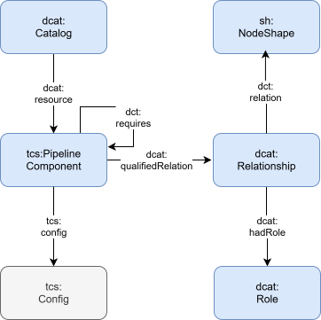
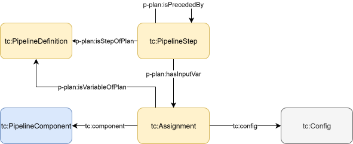
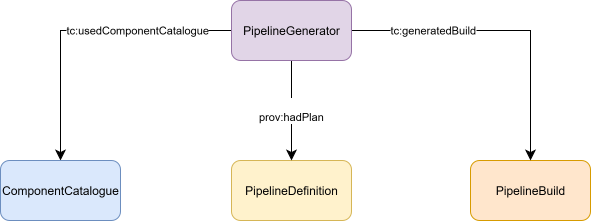
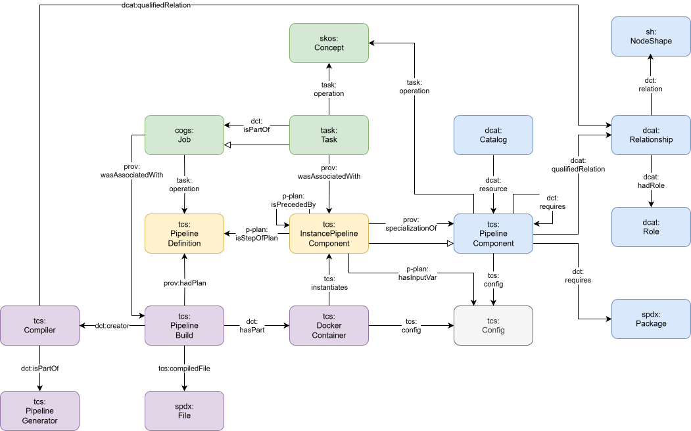

# Table Of Contents

- [1. Overview](#1-overview)
    - [1.1. Introduction](#11-introduction)
    - [1.2 Term definitions](#12-term-definitions)

- [2. Ontology](#2-ontology)
    - [2.1. Namespaces](#21-namespaces)
    - [2.2. Relation to other ontologies](#22-relation-to-other-ontologies)
    - [2.3. Core Classes](#23-core-classes)
    - [2.4. Additional Classes](#24-additional-classes)
    - [2.5. Subclasses of Config](#25-subclasses-of-config)
    - [2.6. Predicate Definitions](#26-predicate-definitions)

- [3. Examples](#3-examples)

  

# 1. Overview
## 1.1 Introduction
*Intention*: discoverability, replication, modular design, separation of concerns, ease of use 
  
The goal is to design a framework-agnostic, streaming-oriented pipeline orchestration system for Linked Data. Pipelines are described semantically using RDF, and execution is realized across multiple frameworks (currently LDIO, RDF Connect, semantic.works) using [Docker containers](https://www.docker.com/). For this purpose, the *toolchain* ontology is developed.

The *toolchain* ontology allows to describe data pipelines for the purpose of replicability. Four Core Classes are established, each of which are concerned with different responsibilities. Providing a minimal **[PipelineDefinition](#pipelinedefinition)** is sufficient to allow replication of a pipeline. Pipelines are defined as a series of data transformation steps, which are executed by [PipelineComponents](#pipelinecomponent). These [PipelineComponents](#pipelinecomponent) are collected in a **[Catalog](#catalog)**, which hence provides the resources for building a pipeline. A [PipelineGenerator](#pipelinegenerator) takes a [PipelineDefinition](#pipelinedefinition) and attempts to build an executable pipeline based on the resources at its disposal in the [Component Catalog](#catalog). The **[PipelineBuild](#pipelinebuild)** is the output of the [PipelineGenerator](#pipelinegenerator) and reflects a deployable pipeline.
  
Splitting the *toolchain* ontology into these four Core Classes leaves a clean separation of concerns: The [PipelineDefinition](#pipelinedefinition) allows the user to create new pipelines with minimal effort: It is sufficient to describe which [PipelineComponents](#pipelinecomponent) provide data to other [PipelineComponents](#pipelinecomponent), and to provide [Configs](#config) to configure each one used in the Pipeline. The [Component Catalog](#catalog) is based on the idea that each [PipelineComponent](#pipelinecomponent) is modular and should be easy to reuse. Hence, all information that is known about a [PipelineComponent](#pipelinecomponent) (and which may be relevant for a [PipelineGenerator](#pipelinegenerator)) should be included in the [Component Catalog](#catalog). This allows a user to merely point to the [PipelineComponent](#pipelinecomponent) in the [Component Catalog](#catalog) when defining a particular [Pipeline Step](#instancepipelinecomponent). Hence, essential details about the component do not need to be repeated with each new [PipelineDefinition](#pipelinedefinition). Likewise, distinguishing between the [PipelineDefinition](#pipelinedefinition) and the [PipelineBuild](#pipelinebuild) allows defining Pipelines without having to be concerned with their implementation. It is up to the [PipelineGenerator](#pipelinegenerator) to figure out a feasible implementation of the pipeline, allowing to largely automate this process: Based on what is known about each [PipelineComponent](#pipelinecomponent), the feasibility of the defined Pipeline can be evaluated and a corresponding [PipelineBuild](#pipelinebuild) can be generated.  
 
Even if the [PipelineGenerator](#pipelinegenerator) is not utilized, the *toolchain* ontology provides a unified language for describing pipelines across different frameworks. This has several advantages. Pipelines and [PipelineComponents](#pipelinecomponent) become discoverable, allowing a community to grow around the idea of sharing modular resources for building pipelines. Datasets can be described by the pipelines that generated them, allowing full provenance. [PipelineDefinitions](#pipelinedefinition) can be subjected to automated validation, so that the feasibility of pipelines does not have to be evaluated through trial and error. 
  

## 1.2 Term definitions

| Term | Definition |
| ----- | ----- |
| **Pipeline** | We understand a Pipeline as an arrangement of modular data transformation steps, whereby each step acts on data in a well-defined, configurable way, before forwarding the data to the next step. These steps can be arranged in a nonlinear way, similar to a directed acyclic graph: Steps can receive zero or more inputs and outputs. To qualify as Pipeline, all Steps have to be directly or indirectly chained to each other. |
| **Data** | Data is any kind of digital content that carries information of interest. This information can be extracted through transformation and made available through transportation, i.e. through Pipelines. As such, Data are the entities that are send through pipeslines to make information available at a target location. |
| **Config** | A Config defines the expected (transformation) behavior for each [Step](#instancepipelinecomponent) in a Pipeline. As such, it differs from Data in so far as it is not subject to transformation itself, does not provide much valuable information beyond the behavior within the Pipeline, and is also not send through the Pipeline. | 
| **Instance** | We understand instantiating [PipelineComponents](#pipelinecomponent) as installing or deploying these so that they are ready to run. | 
  

# 2. Ontology
## 2.1. Namespaces
| prefix |	namespace IRI | documentation |
|----------|----------|----------|
| dcat  | http://www.w3.org/ns/dcat#  | https://www.w3.org/TR/vocab-dcat-3/ |
| dct | http://purl.org/dc/terms/ | https://www.dublincore.org/specifications/dublin-core/dcmi-terms/ |
| p-plan  | http://purl.org/net/p-plan# | https://vocab.linkeddata.es/p-plan/index.html |
| prov  | http://www.w3.org/ns/prov# | https://www.w3.org/TR/prov-o/ |
 rdf  | http://www.w3.org/1999/02/22-rdf-syntax-ns#  | https://www.w3.org/TR/rdf11-concepts/ |
| rdfs | http://www.w3.org/2000/01/rdf-schema#  | https://www.w3.org/TR/rdf-schema/ |
| spdx  | http://spdx.org/rdf/terms#  | https://spdx.github.io/spdx-spec/v3.1-RC1/ |
| sh  | http://www.w3.org/ns/shacl#  | https://www.w3.org/TR/shacl/ |
| tcs  | toolchain specification | the document you are currently reading |

  

## 2.2. Relation to other ontologies
- The [p-plan ontology](https://vocab.linkeddata.es/p-plan/index.html) is used for the *[PipelineDefinition](#pipelinedefinition)*. This is because the *[PipelineDefinition](#pipelinedefinition)* reflects a plan of a pipeline to be built and executed.
- The [dcat-ontology](https://www.w3.org/TR/vocab-dcat-3/) is used for the *[Component Catalog](#catalog)* , which allows expressing [PipelineComponents](#pipelinecomponent) as resources in a catalog. 
- The [prov-ontology](https://www.w3.org/TR/prov-o/) is used to express provenance. 
  

## 2.3. Core Classes
 

### Catalog

| | |
|----------|----------|
| **Definition** | A Catalog is a collection of resources, such as [PipelineComponents](#pipelinecomponent). Each [PipelineComponent](#pipelinecomponent) is a modular unit that can be instanced within a [PipelineBuild](#pipelinebuild). The Catalog stores information for each [PipelineComponent](#pipelinecomponent), which is relevant for instancing. Such information are for example dependencies or constraints that come with including a pipeline component in a pipeline.
| **subclass of** | [dcat:Catalog](https://www.w3.org/TR/vocab-dcat-3/#Class:Catalog) |
| **domain of** | [dcat:resource](https://www.w3.org/TR/vocab-dcat-3/#Property:catalog_resource) |
| **range of** | --- |
 

### PipelineDefinition

| | |
|----------|----------|
| **Definition** | A PipelineDefinition describes the intented pipeline to be run. It is hence a plan for a pipeline that needs to be build. It is sufficient to define which [PipelineComponents](#pipelinecomponent) make part of a pipeline, to define their sequence, and to give [PipelineComponents](#pipelinecomponent) [Configs](#config) to define their behavior. |
| **subclass of** | [p-plan:Plan](https://vocab.linkeddata.es/p-plan/version/17092013/#Plan) |
| **domain of** | --- |
| **range of** | [p-plan:isStepOfPlan](https://vocab.linkeddata.es/p-plan/version/17092013/#isStepOfPlan), [prov:hadPlan](https://www.w3.org/TR/prov-o/#hadPlan) |
 

### PipelineGenerator

| | |
|----------|----------|
| **Definition** | A PipelineGenerator compiles a system capable of executing a [PipelineDefinition](#pipelinedefinition) by looking up the [PipelineComponents](#pipelinecomponent) implicated in the pipeline. Based on a [PipelineDefinition](#pipelinedefinition) and the [Catalog](#catalog), it produces a [PipelineBuild](#pipelinebuild). Therefore it is up to the Generator to decide how the information in the [PipelineDefinition](#pipelinedefinition) and [Component Catalog](#catalog) can be interpreted to produce a deployable pipeline. |
| **subclass of** | [prov:SoftwareAgent](https://www.w3.org/TR/prov-o/#SoftwareAgent) |
| **domain of** | --- |
| **range of** | --- |
 

### PipelineBuild
| | |
|----------|----------|
| **Definition** | A PipelineBuild reflects the pipeline that was generated by the [PipelineGenerator](#pipelinegenerator), and which is ready for deployment. It consists of one or more [DockerContainers](#dockercontainer), which instantiate the [PipelineComponents](#pipelinecomponent) and hence provide the environment for executing the pipeline. |
| **subclass of** | [prov:SoftwareAgent](https://www.w3.org/TR/prov-o/#SoftwareAgent), [spdx:Build](https://spdx.github.io/spdx-spec/v3.1-RC1/model/Build/Classes/Build/) |
| **domain of** | [prov:hadPlan](https://www.w3.org/TR/prov-o/#hadPlan), [dct:hasPart](https://www.dublincore.org/specifications/dublin-core/dcmi-terms/#hasPart), [tcs:compiledFile](#tcscompiledfile), [dct:creator](https://www.dublincore.org/specifications/dublin-core/dcmi-terms/#creator) |
| **range of** | --- |
 

## 2.4. Additional Classes
 

### PipelineComponent
| | |
|----------|----------|
| **Definition** | A PipelineComponent is any modular unit that can be included in a pipeline to help execute a task. It may be a component which produces or transforms data. It may also be a component which is not responsible for forwarding data, but which is needed because another PipelineComponent depends on it. PipelineComponents are resources of the [Catalog](#catalog). Therefore, the need to be described with information relevant for their deployment, such as dependencies and constraints. |
| **subclass of** | --- |
| **domain of** | [tcs:config](#tcsconfig), [dct:requires](https://www.dublincore.org/specifications/dublin-core/dcmi-terms/#requires) |
| **range of** | [dcat:resource](https://www.w3.org/TR/vocab-dcat-3/#Property:catalog_resource), [prov:specializationOf](https://www.w3.org/TR/prov-o/#specializationOf), [tcs:instantiates](#tcsinstantiates), [dct:requires](https://www.dublincore.org/specifications/dublin-core/dcmi-terms/#requires) |
 

### EntryBoundaryComponent
| | |
|----------|----------|
| **Definition** | A [PipelineComponent](#pipelinecomponent) that accepts incoming cross-container traffic — the receiving side of a bridge between two [DockerContainer](#dockercontainer)s in a [PipelineBuild](#pipelinebuild). Concretely, an EntryBoundaryComponent's [InstancePipelineComponent](#instancepipelinecomponent) exposes a transport endpoint (an HTTP listener, a Kafka topic subscriber, ...) that upstream Exit boundaries in another container push data to. Marked with [tcs:channelType](#tcschanneltype) to declare which transport it speaks. Examples: `rdfc:HttpServer`, `ldio:HttpIn`, `sw:mu-identifier`. |
| **subclass of** | [tcs:PipelineComponent](#pipelinecomponent) |
| **domain of** | [tcs:channelType](#tcschanneltype) |
| **range of** | --- |
 

### ExitBoundaryComponent
| | |
|----------|----------|
| **Definition** | A [PipelineComponent](#pipelinecomponent) that pushes outgoing cross-container traffic — the sending side of a bridge, paired with an [EntryBoundaryComponent](#entryboundarycomponent) in the receiving container. An ExitBoundaryComponent's [InstancePipelineComponent](#instancepipelinecomponent) speaks to a remote endpoint whose URL and port are held on the shared [Channel](#channel) it writes to. Marked with [tcs:channelType](#tcschanneltype). Examples: `rdfc:HttpOut`, `ldio:HttpOut`, `rdfc:SPARQLIngest`. |
| **subclass of** | [tcs:PipelineComponent](#pipelinecomponent) |
| **domain of** | [tcs:channelType](#tcschanneltype) |
| **range of** | --- |
 

### InstancePipelineComponent
| | |
|----------|----------|
| **Definition** | A InstancePipelineComponent is any component in a pipeline which acts on data. This can mean producing, transforming, consuming data (ETL) or a combination of these. t is a specialization of a [PipelineComponent](#pipelinecomponent) in that it is instanced by a [DockerContainer](#dockercontainer) as part of a [PipelineBuild](#pipelinebuild). |
| **subclass of** | [p-plan:Step](https://vocab.linkeddata.es/p-plan/version/17092013/#Step) |
| **domain of** | [prov:specializationOf](https://www.w3.org/TR/prov-o/#specializationOf), [p-plan:isStepOfPlan](https://vocab.linkeddata.es/p-plan/version/17092013/#isStepOfPlan), [p-plan:isPrecededBy](https://vocab.linkeddata.es/p-plan/version/17092013/#isPreceededBy), [tcs:writesTo](#tcswritesto), [tcs:readsFrom](#tcsreadsfrom), [p-plan:hasInputVar](https://vocab.linkeddata.es/p-plan/version/17092013/#hasInputVar), [tcs:segment](#tcssegment) |
| **range of** | [p-plan:isPrecededBy](https://vocab.linkeddata.es/p-plan/version/17092013/#isPreceededBy), [tcs:runs](#tcsruns) |
 

### Channel
| | |
|----------|----------|
| **Definition** | A channel is a transport route by which data is transferred from one [InstancePipelineComponent](#instancepipelinecomponent) to another. This entity can be used to either configure the means of transport (e.g. http, kafka, etc.) or to describe on which conditions a channel is to be used (e.g. "on success", "on fail", etc.).
| **subclass of** | --- |
| **domain of** | [tcs:endpoint](#tcsendpoint), [tcs:port](#tcsport) |
| **range of** | [tcs:readsFrom](#tcsreadsfrom), [tcs:writesTo](#tcswritesto) |
 

### HttpChannel
| | |
|----------|----------|
| **Definition** | A [Channel](#channel) whose transport is HTTP. Marks the channel as expecting an `tcs:endpoint` (URL of the receiving side) and a `tcs:port` (the port on which the receiver listens). Used by [BridgeTransportCompiler](#compiler) to match [EntryBoundaryComponent](#entryboundarycomponent)s with [ExitBoundaryComponent](#exitboundarycomponent)s that speak the same transport. |
| **subclass of** | [tcs:Channel](#channel) |
| **domain of** | --- |
| **range of** | [tcs:channelType](#tcschanneltype) |
 

### SparqlUpdateChannel
| | |
|----------|----------|
| **Definition** | A [HttpChannel](#httpchannel) that exchanges SPARQL Update payloads specifically, as opposed to arbitrary JSON-LD. Used to distinguish endpoints that speak SPARQL over HTTP (e.g. RDF-Connect's `rdfc:SPARQLIngest`, semantic.works' `sw:mu-identifier`) from generic HTTP JSON-LD endpoints so they are not confused at bridge-matching time. |
| **subclass of** | [tcs:HttpChannel](#httpchannel) |
| **domain of** | --- |
| **range of** | [tcs:channelType](#tcschanneltype) |
 

### Config
| | |
|----------|----------|
| **Definition** | A Config is a set of input parameters for a [PipelineComponent](#pipelinecomponent), which defines its behavior in a pipeline. In its simplest case, it is a set of key-value pairs. However, also nested configurations are possible. As a data structure a Config is equivalent to the "object" type in JSON, consisting of an unordered set of name/value pairs. The name is a string and the value is a string, number, boolean, array, or object (same concept as in the [Common Workflow Language](https://www.commonwl.org/v1.2/Workflow.html#Data_concepts)), resulting in an unordered, tree-like (acyclic) structure. Each Config requires either a [tcs:embedded](#tcsembedded) or [tcs:literal](#tcsliteral)-predicate. This tells the [PipelineGenerator](#pipelinegenerator) whether the Config is contained in the graph or must be parsed from a string-literal. If [tcs:embedded](#tcsembedded) is used, the Config points to a blank node representing a data object: Predicates serve as keys and objects as values. If [tcs:literal](#tcsliteral) is used, the Config points to a string, with the format of the Config specified with dct:format. In this case the [PipelineGenerator](#pipelinegenerator) parses the string to extract the configuration data. A Config can be stored as a preset in the [Component Catalog](#catalog). In this case a [PipelineComponent](#pipelinecomponent) can point to its associated Configs via [tcs:config](#tcsconfig). This is ideal for attaching default configurations, or attaching configurations often needed for specific use cases. Subclasses of tcs:Config (see [section 2.5](#25-subclasses-of-config)) act as **compiler-facing hints** identifying what the Config concerns — a Dockerfile, a docker-compose stanza, a pipeline runtime config, etc. — which lets compilers select the configs relevant to them from among the multiple configs a component may carry. |
| **subclass of** | --- |
| **domain of** | [tcs:embedded](#tcsembedded), [tcs:literal](#tcsliteral), [dct:format](https://www.dublincore.org/specifications/dublin-core/dcmi-terms/#format) |
| **range of** | [tcs:config](#tcsconfig), [p-plan:hasInputVar](https://vocab.linkeddata.es/p-plan/version/17092013/#hasInputVar) |
 

### sh:NodeShape
| | |
|----------|----------|
| **Definition** | A NodeShape reflects a constraint, which needs to be validated whenever a [PipelineComponent](#pipelinecomponent) becomes part of a [PipelineBuild](#pipelinebuild). These constraints can concern different aspects of a PipelineBuild. For example, each [Config](#config) assigned to a specific [PipelineComponent](#pipelinecomponent) may have to comply to a schema. A [PipelineComponent](#pipelinecomponent) may not accept data input from another Component, because it itself produces data. Or a [PipelineComponent](#pipelinecomponent) may pose specific constraints on how [Pipeline Steps](#instancepipelinecomponent) may be linked, such as expecting a strictly linear pipeline. It is also possible to describe constraints for the expected data input and output of [PipelineComponents](#pipelinecomponent). Taken together, defining NodeShapes are a powerful tool to ensure that pipelines run as expected before being deployed. These constraints are expressed as SHACL-shapes to allow automatic validation. Each sh:NodeShape should have a sh:message for human readibility. These should clearly indicate and describe what kind of constraint is imposed, to allow easier implementation of the logic behind the constraint. Node Shapes are only indirectly linked to [PipelineComponents](#pipelinecomponent) via dcat:Relationship. This allows to further qualify the relationship between [PipelineComponents](#pipelinecomponent) and their constraints. For example, dcat:Role can be used to indicate that a constraint belongs to a specific category, for example concerning input data, output data or [Configs](#config). Dcat:Relationship may also be used to define when a constraint should be validated, for example before or after building the pipeline. |
| **subclass of** | --- |
| **domain of** | --- |
| **range of** | [dct:relation](https://www.dublincore.org/specifications/dublin-core/dcmi-terms/#relation) |
 

### DockerContainer
| | |
|----------|----------|
| **Definition** | A DockerContainer is the core entity of a [PipelineBuild](#pipelinebuild). Each [PipelineBuild](#pipelinebuild) consists of one or more DockerContainers, which are responsible for executing one or more [Pipeline Steps](#instancepipelinecomponent). For this purpose, one or more [PipelineComponents](#pipelinecomponent) are instantiated within the DockerContainer. A DockerContainer is defined through several [Configs](#config), which are generated by the [PipelineGenerator](#pipelinegenerator) as part of the [PipelineBuild](#pipelinebuild). These Configs define how the DockerContainer should be build, started up, and configured for its task. 
| **subclass of** | --- |
| **domain of** | [tcs:instantiates](#tcsinstantiates), [tcs:runs](#tcsruns) |
| **range of** | [dct:hasPart](https://www.dublincore.org/specifications/dublin-core/dcmi-terms/#hasPart) |
 

### File
| | |
|----------|----------|
| **Definition** | A File describes the output artifacts that the [PipelineGenerator](#pipelinegenerator) produces as part of the [PipelineBuild](#pipelinebuild). A File has a filename, filepath and content. These are attached to an spdx:File via [tcs:filename](#tcsfilename), [tcs:filepath](#tcsfilepath) and [tcs:literal](#tcsliteral), respectively. We use tcs:literal here because currently file content is exclusively expressed as literal strings of various formats (yaml, json, ttl ...). |
| **subclass of** | --- |
| **domain of** | [tcs:filename](#tcsfilename), [tcs:filepath](#tcsfilepath), [tcs:literal](#tcsliteral) |
| **range of** | [tcs:compiledFile](#tcscompiledfile) |
 

### Compiler
| | |
|----------|----------|
| **Definition** | A Compiler acts as translation layer between the [PipelineDefinition](#pipelinedefinition) and framework-specific implementation logic. It does so by acting on the [PipelineBuild](#pipelinebuild); it defines which files and folders are required for the Pipeline to be instantiated. Making Compilers explicitly part of the catalog has two advantages: For provenance, a [PipelineBuild](#pipelinebuild) can declare what compilers were used for its creation. For validation, [sh:NodeShapes](#shnodeshape) can be attached to compilers. In this way it can be made explicit which properties a Compiler expects for its compilation process. |
| **subclass of** | --- |
| **domain of** | --- |
| **range of** | [dct:creator](https://www.dublincore.org/specifications/dublin-core/dcmi-terms/#creator) |
 

## 2.5. Subclasses of Config

The subclasses below classify a [Config](#config) by what it concerns — a docker-compose stanza, a Dockerfile, a pipeline's runtime parameters, a default fallback. This lets compilers select the configs relevant to their target output from among the multiple configs a component may carry. Adding a new kind of config (for a new framework or file type) is done by minting a new subclass. None of the subclasses below introduce predicates of their own — their domain/range is identical to [tcs:Config](#config)'s.

### DockerComposeConfig
| | |
|----------|----------|
| **Definition** | The DockerComposeConfig defines how the [DockerContainer](#dockercontainer) should be started up, for example which volumes should be mounted and which ports should be opened. |
| **subclass of** | [tcs:Config](#config) |
 

### DockerImageConfig
| | |
|----------|----------|
| **Definition** | The DockerImageConfig defines how the a docker image must be build, it is the content of a Dockerfile. |
| **subclass of** | [tcs:Config](#config) |
 

### PipelineConfig
| | |
|----------|----------|
| **Definition** | The PipelineConfig are those input parameters that the [DockerContainer](#dockercontainer) requires to execute the [Pipeline Steps](#instancepipelinecomponent) as intended.  |
| **subclass of** | [tcs:Config](#config) |
 

### DefaultConfig
| | |
|----------|----------|
| **Definition** | The Config that should be used for a [PipelineComponent](#pipelinecomponent) if not other Config is assigned in a [PipelineDefinition](#pipelinedefinition).  |
| **subclass of** | [tcs:Config](#config) |
 

## 2.6. Predicate Definitions

Predicates native to the `tcs:` namespace, each with its domain and range. Predicates borrowed from other ontologies (`p-plan:`, `dcat:`, `prov:`, `dct:`, `spdx:`) keep their original semantics, documented in their respective specifications (see [2.2. Relation to other ontologies](#22-relation-to-other-ontologies)); they only appear above, in the "domain of" / "range of" rows of the classes they connect.

### tcs:config
| | |
|----------|----------|
| **Definition** | Points from a [PipelineComponent](#pipelinecomponent) to a [Config](#config) stored as a preset in the Catalog, e.g. a default or use-case-specific configuration. |
| **domain** | [tcs:PipelineComponent](#pipelinecomponent) |
| **range** | [tcs:Config](#config) |
 

### tcs:embedded
| | |
|----------|----------|
| **Definition** | Points from a [Config](#config) to a blank node holding its parameters directly in the graph, as an alternative to [tcs:literal](#tcsliteral). |
| **domain** | [tcs:Config](#config) |
| **range** | RDF node (embedded data object) |
 

### tcs:literal
| | |
|----------|----------|
| **Definition** | Points from a [Config](#config) or a [File](#file) to a string holding its body verbatim. On a Config the string's format is given by dct:format; on a File the string is the file's raw content. |
| **domain** | [tcs:Config](#config), spdx:File (see [File](#file)) |
| **range** | xsd:string |
 

### tcs:readsFrom
| | |
|----------|----------|
| **Definition** | Declares that an [InstancePipelineComponent](#instancepipelinecomponent) consumes data from a [Channel](#channel). Complementary to [p-plan:isPrecededBy](https://vocab.linkeddata.es/p-plan/version/17092013/#isPreceededBy): the latter is a terser way to declare step order and is expanded into concrete channel wiring where unambiguous, but an explicit tcs:readsFrom is required to disambiguate which channel a step reads from when more than one is available (e.g. a branching producer). |
| **domain** | [tcs:InstancePipelineComponent](#instancepipelinecomponent) |
| **range** | [tcs:Channel](#channel) |
 

### tcs:writesTo
| | |
|----------|----------|
| **Definition** | Declares that an [InstancePipelineComponent](#instancepipelinecomponent) produces data onto a [Channel](#channel). Complementary to [p-plan:isPrecededBy](https://vocab.linkeddata.es/p-plan/version/17092013/#isPreceededBy) in the same way as [tcs:readsFrom](#tcsreadsfrom): required to disambiguate which channel a step writes to when more than one is available. |
| **domain** | [tcs:InstancePipelineComponent](#instancepipelinecomponent) |
| **range** | [tcs:Channel](#channel) |
 

### tcs:instantiates
| | |
|----------|----------|
| **Definition** | Declares that a [DockerContainer](#dockercontainer) instantiates a [PipelineComponent](#pipelinecomponent). |
| **domain** | [tcs:DockerContainer](#dockercontainer) |
| **range** | [tcs:PipelineComponent](#pipelinecomponent) |
 

### tcs:runs
| | |
|----------|----------|
| **Definition** | Declares that a [DockerContainer](#dockercontainer) executes a specific [InstancePipelineComponent](#instancepipelinecomponent) (pipeline step). |
| **domain** | [tcs:DockerContainer](#dockercontainer) |
| **range** | [tcs:InstancePipelineComponent](#instancepipelinecomponent) |
 

### tcs:compiledFile
| | |
|----------|----------|
| **Definition** | Links a [PipelineBuild](#pipelinebuild) to a generated [File](#file). |
| **domain** | [tcs:PipelineBuild](#pipelinebuild) |
| **range** | spdx:File (see [File](#file)) |
 

### tcs:filename
| | |
|----------|----------|
| **Definition** | The filename of a generated [File](#file), e.g. `docker-compose.yml`. |
| **domain** | spdx:File (see [File](#file)) |
| **range** | xsd:string |
 

### tcs:filepath
| | |
|----------|----------|
| **Definition** | The folder path, relative to the project root, that a generated [File](#file) must be written to. |
| **domain** | spdx:File (see [File](#file)) |
| **range** | xsd:string |
 

### tcs:channelType
| | |
|----------|----------|
| **Definition** | Declares the transport a boundary component speaks, by pointing at a subclass of [Channel](#channel) (e.g. [HttpChannel](#httpchannel), [SparqlUpdateChannel](#sparqlupdatechannel)). Used by [BridgeTransportCompiler](#compiler) to match [EntryBoundaryComponent](#entryboundarycomponent)s with [ExitBoundaryComponent](#exitboundarycomponent)s at auto-insertion time, and propagated onto the [Channel](#channel) that a boundary step reads from / writes to so pre-compile SHACL shapes see the same channel type the compiler will mint. |
| **domain** | [tcs:EntryBoundaryComponent](#entryboundarycomponent), [tcs:ExitBoundaryComponent](#exitboundarycomponent) |
| **range** | rdfs:Class (a subclass of [tcs:Channel](#channel)) |
 

### tcs:endpoint
| | |
|----------|----------|
| **Definition** | The URL of the receiving side of a cross-container [Channel](#channel), populated at compile time by an Entry [PipelineComponent](#pipelinecomponent)'s config compiler and read by the paired Exit config compiler. Together with [tcs:port](#tcsport) it forms the transport metadata Entry and Exit boundaries share via the channel, without either side needing to know about the other. |
| **domain** | [tcs:Channel](#channel) |
| **range** | xsd:string |
 

### tcs:port
| | |
|----------|----------|
| **Definition** | The port on which the receiving side of a cross-container [Channel](#channel) listens. Same population/consumption pattern as [tcs:endpoint](#tcsendpoint). |
| **domain** | [tcs:Channel](#channel) |
| **range** | xsd:integer |
 

### tcs:segment
| | |
|----------|----------|
| **Definition** | Tags an [InstancePipelineComponent](#instancepipelinecomponent) with the pipeline segment it belongs to. A segment is a maximal chain of steps sharing one container that data can flow through without crossing a container boundary. Written by `SegmentTagger` after `BridgeTransportCompiler` has finalized boundary insertion, and used by per-framework config compilers that must emit one config artifact per segment (LDIO's Pattern A2 directory-scan) as well as by segment-scoped SHACL shapes such as `tcs:LdioSingularStepShape`. |
| **domain** | [tcs:InstancePipelineComponent](#instancepipelinecomponent) |
| **range** | RDF node |
 

# 3. Examples

For a concrete example check the catalog and [pipeline definition](../pipeline%20generator/data/pipelines/pipeline_definition.ttl) used by the pipeline generator. The catalog is split per framework: [catalog-core.ttl](../pipeline%20generator/data/catalog/catalog-core.ttl) (shared declarations), [catalog-ldio.ttl](../pipeline%20generator/data/catalog/catalog-ldio.ttl), [catalog-sw.ttl](../pipeline%20generator/data/catalog/catalog-sw.ttl), and for RDF-Connect [catalog-rdfc.ttl](../pipeline%20generator/data/catalog/catalog-rdfc.ttl) — which is generated from each package's own published definition rather than hand-written, see [§3.1 of the pipeline generator README](../pipeline%20generator/README.md#31-generating-the-rdf-connect-catalog). 